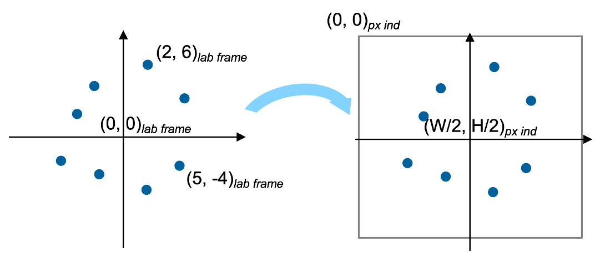
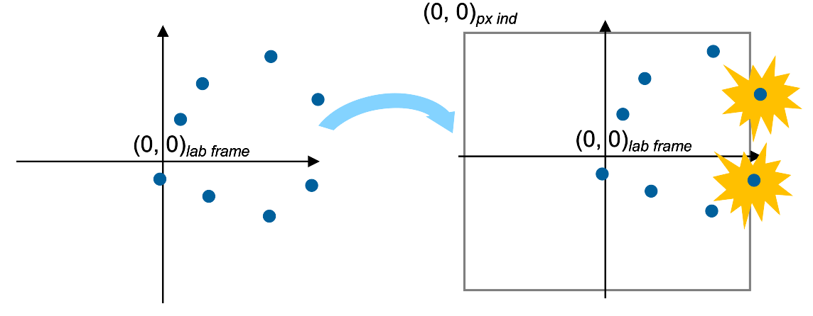
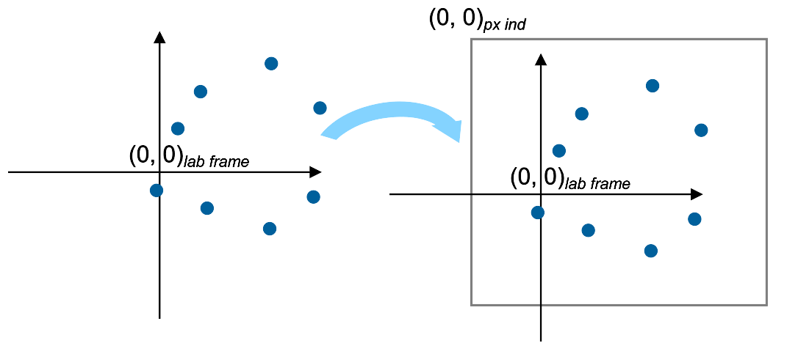

Mapping of probe positions in object tensor
===========================================

The probe positions provided by the user are assumed to be in the lab frame and can have
arbitrary origin. Internally, Pty-Chi needs to map the given positions to the object tensor,
where the origin of the pixel coordinates (0, 0) is at the top left corner of the tensor. 
This needs to be done so that Pty-Chi knows which pixel in the tensor should be read or written
during computation. 

If the positions are given such that Pty-Chi needs to access pixels outside the object tensor,
it pads the tensor automatically. However, this can cause the reconstructed object to be cut
off, and may lead to other numerical issues. It is most ideal to avoid this padding by (1)
create an object buffer large enough to accommodate the probe tensor at all positions, and (2)
to map the probe positions to the object tensor's frame properly.

By default, the origin (0, 0) of the input positions is mapped to the center of the object tensor,
as shown in the figure below. 

Without proper centering, this mapping may result in out-of-bounds access when the probe positions are
highly unsymmetric and contain outliers. The figure below shows an example of such a case:
the origin of input positions is situated at the left edge of the point cloud of all positions.
When this point is mapped to the center of the object tensor, the rightmost positions goes out
of bounds.

To avoid this, one can manually center the probe positions by subtracting the mean or median of
the probe positions from all of them. Alternatively, one can also let Pty-Chi put the middle point of the point cloud
at the center of the object tensor regardless of the origin of the input positions (shown in the figure below). To enable this,
set :attr:`~ptychi.api.options.base.ObjectOptions.determine_position_origin_coords_by` to 
``ObjectPosOriginCoordsMethods.POSITIONS``. Read the API reference of this option for more details.

